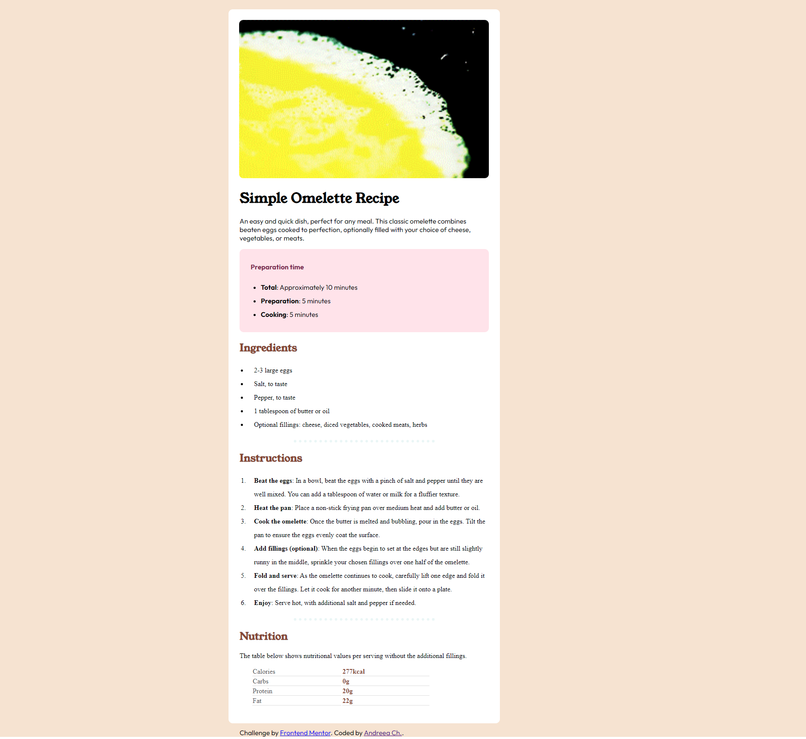

# Frontend Mentor - Recipe page solution

This is a solution to the [Recipe page challenge on Frontend Mentor](https://www.frontendmentor.io/challenges/recipe-page-KiTsR8QQKm). Frontend Mentor challenges help you improve your coding skills by building realistic projects. 

## Table of contents

- [Overview](#overview)
  - [The challenge](#the-challenge)
  - [Screenshot](#screenshot)
  - [Links](#links)
  - [My process](#my-process)
  - [Built with](#built-with)
  - [What I learned](#what-i-learned)
  - [Other tools used](#other-tools-used)
  - [Useful resources](#useful-resources)

## Overview

### Screenshot

![]

### Links

- Solution URL: [Add solution URL here](https://your-solution-url.com)
- Live Site URL: [Add live site URL here](https://your-live-site-url.com)

## My process

### Built with

- Semantic HTML5 markup
- CSS custom properties
- CSS Grid

### Other tools used:
- Pesticide extension -> this is perfect to outline eacth element to better see the placement on the page  
- Developer tools -> available on any browser and is ideal for experimenting with changes to your page without affecting your code

### What I learned

1. Adjusting the distance between text and bullet points:
.Ingredients li,        
.Instructions li {
    padding-left: 15px; 
}

2. Implementing a table layout and adjusting its width for a more spacious appearance::
table {
    table-layout: auto;  /* to lay out table cells, rows, and columns */
    width: 66%;
    margin-left: 54px;
}

3. Applying a combination of position: relative and position: absolute and other styles to achieve a layout similar to the reference image for different sections of the project:
a. the main page:
.main-page {
    background-color:hsl(0, 0%, 100%);
    border-radius: 10px;
    position: absolute;
    left: 540px;
    top: 29px;
    width: 40rem;    
}

b.footer:
.attribution {                    
    margin: 20px 26px auto 26px;
    font-family: 'Outfit', sans-serif;
    position: relative;  
    top: 32px;           
}

4.Adding hover effects to highlight important elements and improve text readability:

a.for the list
.Ingredients ul,
.Instructions ol {           
  strong:hover {background-color: #faffb1} 
}

b.for the table:
tr:hover {background-color: #fde3a2;
}

### Useful resources

- [Example resource 1](https://developer.mozilla.org/en-US/) - This resource proved valuable to me when I had to search for specific HTML or CSS elements for my project. I highly recommend this site to anyone looking to initiate their learning journey in HTML and CSS. It also offers a comprehensive set of learning materials tailored for novice developers and students.

- [Example resource 2](https://www.w3schools.com/) - This is additionally valuable for refining coding skills, and the "try me" section is beneficial if you wish to observe the code in action.

